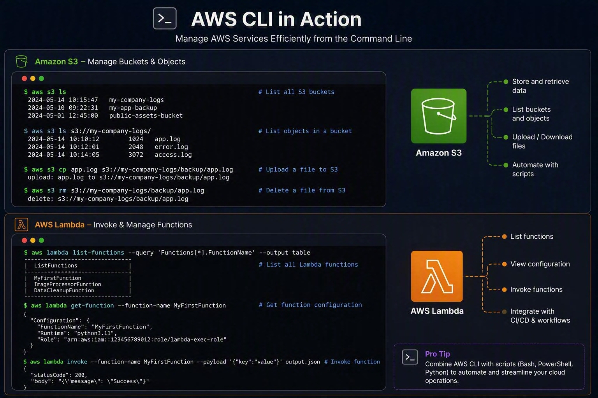
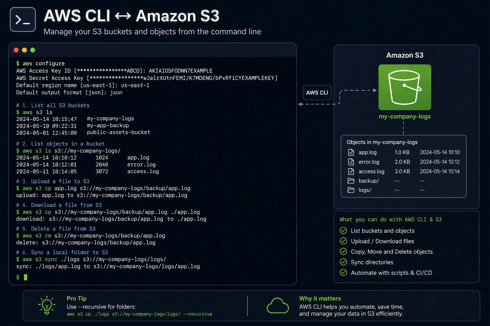

#  Why Every Cloud Engineer Should Learn AWS CLI
While the AWS Management Console is great for visualizing resources, the **AWS Command Line Interface (AWS CLI)** is where efficiency, automation, and scalability truly come to life.
Whether you're managing a few resources or an entire cloud estate, AWS CLI can save countless hours by enabling quick access to AWS services directly from your terminal.

### Here are some practical commands I regularly find useful:

**List all S3 buckets**
```bash
aws s3 ls
```

**View running EC2 instances**
```bash
aws ec2 describe-instances \

--query 'Reservations[*].Instances[*].[InstanceId,State.Name]' \

--output table
```

**Check Lambda function configuration**
```bash
aws lambda get-function \

--function-name MyLambdaFunction
```
 
 **View CloudTrail trails**
 ```bash
aws cloudtrail describe-trails
```

**Retrieve CloudWatch metrics**
```bash
aws cloudwatch list-metrics \
--namespace AWS/Lambda
```

**Identify the currently authenticated AWS account**
```bash
aws sts get-caller-identity
```


The real power comes when these commands are combined with PowerShell, Bash, Python, or CI/CD pipelines to automate repetitive operational tasks.

### Benefits I've seen from using AWS CLI:
- ✅ Faster troubleshooting
- ✅ Reduced manual effort
- ✅ Consistent deployments
- ✅ Improved operational efficiency
- ✅ Easier automation and scripting

***As cloud environments continue to grow, mastering AWS CLI isn't just a nice-to-have skill, it's an essential tool for modern cloud operations.***

**Bonus command that every AWS engineer should know:**
```bash
aws sts get-caller-identity
```
___________________________________________________________


___________________________________________________________



**Helpful Links**

- [AWS CLI](https://docs.aws.amazon.com/cli/)
- [AWS CLI for S3](https://docs.aws.amazon.com/cli/latest/reference/s3/)
- [AWS CLI for Lambda](https://docs.aws.amazon.com/cli/latest/reference/lambda/)
- [AWS CLI for EC2](https://docs.aws.amazon.com/cli/latest/reference/ec2/)
- [AWS CLI command examples](https://docs.aws.amazon.com/cli/v1/userguide/cli-chap-code-examples.html)
- [Security in the AWS CLI](https://docs.aws.amazon.com/cli/v1/userguide/security.html)
