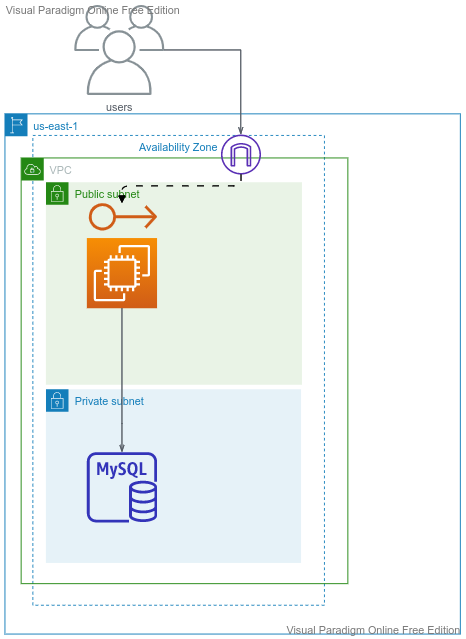
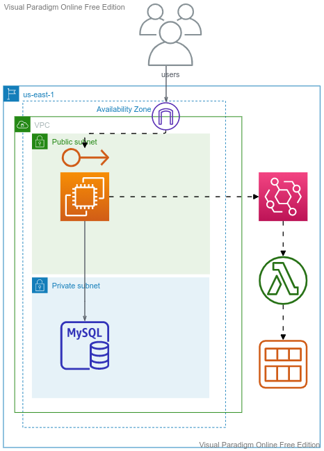

# AWS-EC2

## Topics
-	Compute in AWS
-	EC2 Tenancy and Types
-	SSH and concept of Keys
-	Public IP, Private IP, Elastic IP
-	Create Linux instances (public and private) and securely ssh into to it
-	Security Groups
-	Instance MetaData
-	Instance UserData
-	Assign IAM Roles to EC2 Instance
-	Create an AMI
________________________________________
## Compute in AWS:
-	EC2
-	ECS - Containers
-	Lambda
________________________________________
## What is EC2
-	Infrastructure as Service
-	Virtual Servers in AWS
-	Input:
   -	OS
   -	CPU
   - 	RAM
   -  Storage
   -	Network details
   -	Firewall Rules
   -  bootstrap script (optional)
________________________________________
## EC2 Tenancy
-	Shared:
-	On-Demand
-	Spot
-	Reserved
-	Dedicated Instance
-	Dedicated Host
## Instance Types:
-	T2/T3 - General Purpose
-	C - Compute Optimized
-	R - Memory Optimized
________________________________________
## Public IP, Private IP, Elastic IP
A **Public IP** address is how the internet identifies you. A public IP address is the IP address that communicates your internet connected device to the public internet. Public IP will be modified with ec2 stop/start.

A **Private IP** address is how the VPC identifies you. A private IP address is the IP address that communicates with other devices in your VPC. Private IP will not be modified with ec2 stop/start and reboot.

A **Elastic IP** address is a Public IP address which is static.
________________________________________
Connect to EC2
-	SSH, also known as Secure Shell or Secure Socket Shell, is a network protocol that gives users, particularly system administrators, a secure way to access a computer over an unsecured network.
-	Secure Shell provides strong password authentication and public key authentication, as well as encrypted data communications between two computers connecting over an open network, such as the internet.
__________________________________________


# SSH into the EC2 instance - 1
__________________________________________
- ssh into public instance using private key
  


# SSH into the EC2 instance - 2
___________________________________________
- ssh into private instance with ssh agent forwarding


# SSH into the EC2 instance - 3

```bash
eval `ssh-agent -s`
ssh-add -k <PEM FILE>
ssh-add -l
ssh -A <user>@<IP ADDRESS>
```
# Demo
________________________________________________
- Web Server with RDS
- Web Server crash and Create an AMI
- Create new Web Server from the AMI
- Attach Elastic IP to avoid redistributing the IP
- Instance MetaData
- Instance UserData

# Instance MetaData and UserData

```bash
  #!/bin/bash
  yum update -y
  yum install -y httpd
  systemctl start httpd
  systemctl enable httpd
  echo "Hello World $(hostname -f)" > /var/www/html/index.html

  curl http://169.254.169.254/latest/meta-data/local-ipv4
  
  curl http://169.254.169.254/latest/meta-data/iam/security-credentials/EC2_S3FullAccessRole

  curl http://169.254.169.254/latest/user-data
```
_____________________________________________________

```bash
  sudo mkfs -t ext4 /dev/xvdb
  sudo mount /dev/xvdb /mnt
  sudo umount /mnt
```
_______________________________________________________

# Web Server with RDS



----------------------------------------------------------

# Web Server with RDS - Automation





# Hlpful Links
- [Securely Connect to Linux Instances Running in a Private Amazon VPC](https://aws.amazon.com/blogs/security/securely-connect-to-linux-instances-running-in-a-private-amazon-vpc)
- [Access instance metadata for an EC2 instance](https://docs.aws.amazon.com/AWSEC2/latest/UserGuide/instancedata-data-retrieval.html)
- [A Case Study of the Capital One Data Breach](http://web.mit.edu/smadnick/www/wp/2020-16.pdf)
- [AWS Enhances Metadata Service Security with IMDSv2](https://medium.com/@shurmajee/aws-enhances-metadata-service-security-with-imdsv2-b5d4b238454b)
- [Capital One Data Breach: A Cloud Security Case Study](https://medium.com/swlh/capital-one-data-breach-a-cloud-security-case-study-7a06ec900460)
- [Install a web server on your EC2 instance](https://docs.aws.amazon.com/AmazonRDS/latest/UserGuide/CHAP_Tutorials.WebServerDB.CreateWebServer.html)
- [5 Differences Between Symmetric vs Asymmetric Encryption](https://sectigostore.com/blog/5-differences-between-symmetric-vs-asymmetric-encryption/)
- [What is SSH? Understanding SSH and its encryption techniques](https://www.hostinger.com/tutorials/ssh-tutorial-how-does-ssh-work)
- [How to setup SSH key based authentication on Linux server](https://dyclassroom.com/reference-server/how-to-setup-ssh-key-based-authentication-on-linux-server)
- [Why Authentication Using SSH Public Key is Better than Using Password and How Do They Work?](https://blog.runcloud.io/why-authentication-using-ssh-public-key-is-better-than-using-password-and-how-do-they-work/)
- [How SSH encrypts communications, when using password-based authentication?](https://stackoverflow.com/questions/59555705/how-ssh-encrypts-communications-when-using-password-based-authentication)
- [Connect to your DreamCompute Instance with SSH keys in Window](https://help.dreamhost.com/hc/en-us/articles/115001764232-Connect-to-your-DreamCompute-Instance-with-SSH-keys-in-Windows)
