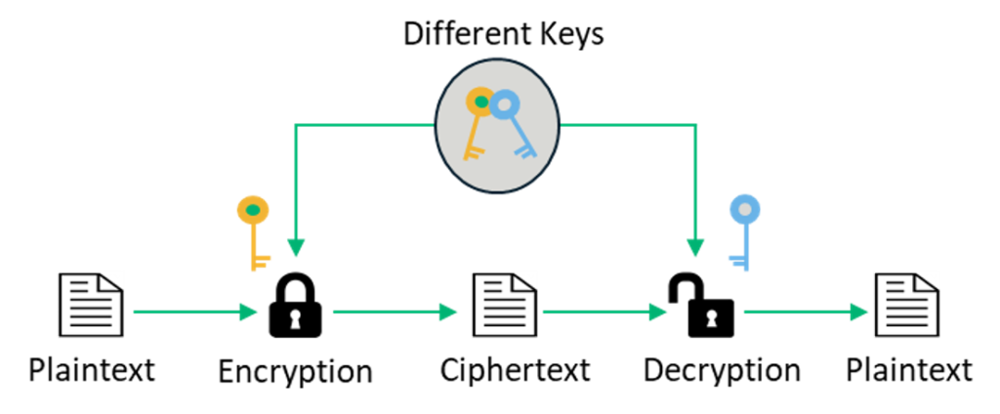
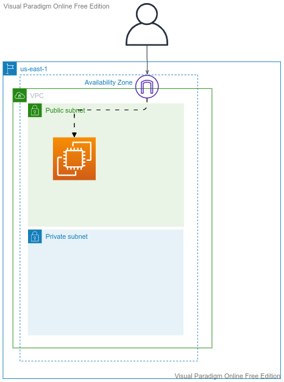
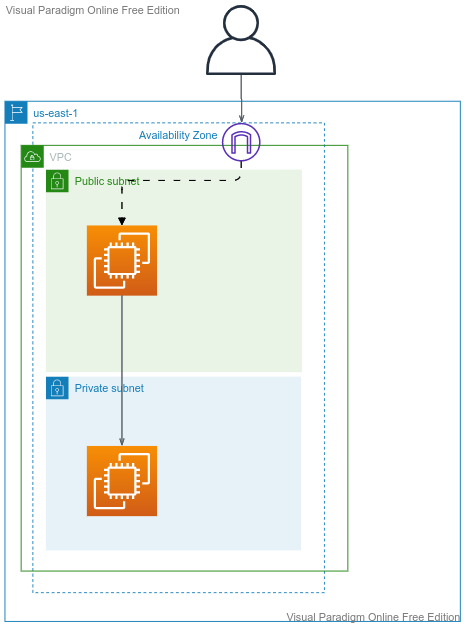

# AWS-EC2

## Topics
-	Compute in AWS
-	EC2 Tenancy and Types
-	SSH and concept of Keys
-	Public IP, Private IP, Elastic IP
-	Create Linux instances (public and private) and securely ssh into to it
-	Security Groups
-	Instance MetaData
-	Instance UserData
-	Assign IAM Roles to EC2 Instance
-	Create an AMI
________________________________________
## Compute in AWS:
-	EC2
-	ECS - Containers
-	Lambda
________________________________________
## What is EC2
-	Infrastructure as Service
-	Virtual Servers in AWS
-	Input:
   -	OS
   -	CPU
   - 	RAM
   -  Storage
   -	Network details
   -	Firewall Rules
   -  bootstrap script (optional)
________________________________________
## EC2 Tenancy
-	Shared:
-	On-Demand
-	Spot
-	Reserved
-	Dedicated Instance
-	Dedicated Host
## Instance Types:
-	T2/T3 - General Purpose
-	C - Compute Optimized
-	R - Memory Optimized
________________________________________
## Public IP, Private IP, Elastic IP
A **Public IP** address is how the internet identifies you. A public IP address is the IP address that communicates your internet connected device to the public internet. Public IP will be modified with ec2 stop/start.

A **Private IP** address is how the VPC identifies you. A private IP address is the IP address that communicates with other devices in your VPC. Private IP will not be modified with ec2 stop/start and reboot.

A **Elastic IP** address is a Public IP address which is static.
________________________________________
Connect to EC2
-	SSH, also known as Secure Shell or Secure Socket Shell, is a network protocol that gives users, particularly system administrators, a secure way to access a computer over an unsecured network.
-	Secure Shell provides strong password authentication and public key authentication, as well as encrypted data communications between two computers connecting over an open network, such as the internet.
__________________________________________

# SSH into the EC2 instance - 1
__________________________________________
- ssh into public instance using private key
  

# SSH into the EC2 instance - 2
___________________________________________
- ssh into private instance with ssh agent forwarding

