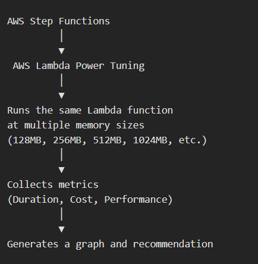
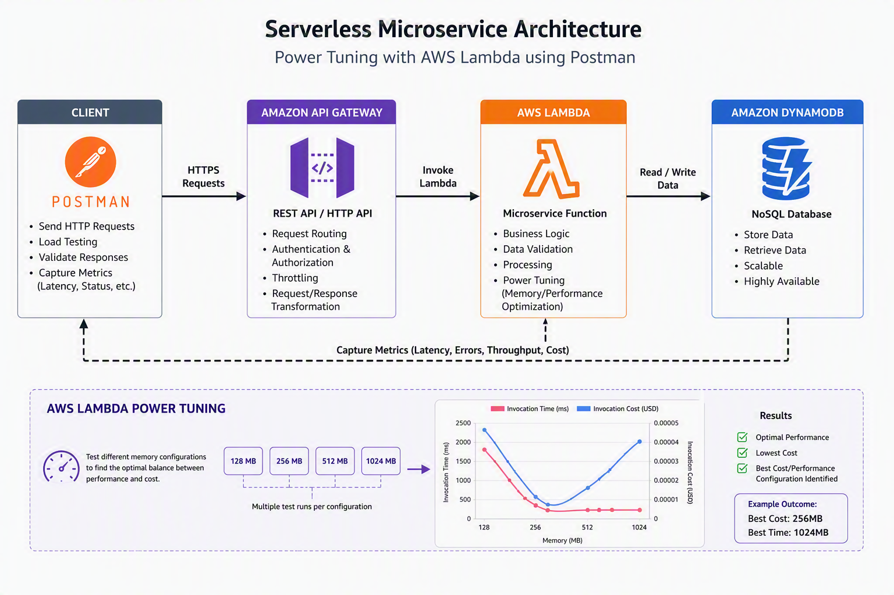
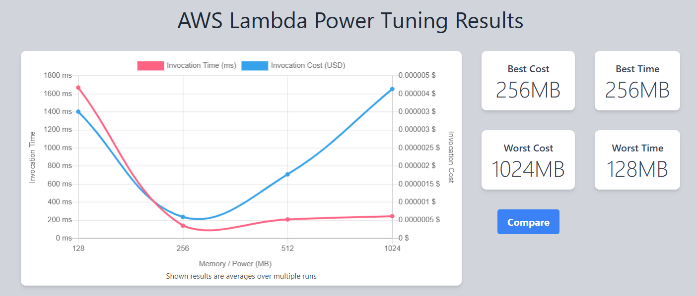

# AWS Lambda Power Tunning

**AWS Lambda Power Tuning** is an AWS open-source tool that helps you determine the optimal memory configuration for a Lambda function by testing multiple memory sizes and comparing their performance and cost.

Instead of guessing whether your Lambda should run at 256 MB, 512 MB, 1024 MB, or 3008 MB, the tool executes the function at different memory levels and produces a visual report showing:

- Execution duration
- Estimated cost
- Performance improvements
- Cost vs performance trade-offs
- The "sweet spot" where both factors are balanced

## How it Works

______________________________________________
## Why Use It

Suppose your Lambda runs at 128 MB:
- Execution Time: 2.5 seconds
- Cost: Higher than expected due to long runtime

We can use this tool from AWS to optimise Performance and cost. 
________________________________________________________________

## Overview of Project
This project demonstrates how AWS Lambda Power Tuning can be used to identify the optimal memory configuration for a serverless microservice.

The solution follows a serverless architecture using Postman to send HTTPS requests to API Gateway, which in turn invokes Lambda Function.

Using Postman-generated API requests, multiple Lambda memory configurations were tested to evaluate the relationship between execution time and cost.
___________________________________________________________________________________________

## Objectives
- Improve Lambda execution performance
- Reduce API response times
- Optimise operational costs
- Identify the optimal performance-to-cost ratio
- Establish a repeatable performance testing approach
______________________________________________________

## At 512 MB

When memory increased from 128 MB (worst) for Cost and Performance to 512, noticed that cost went down slightly low, but overall performance increased significantly. Cost is still higher and could be optimised further.

_____________________________________

